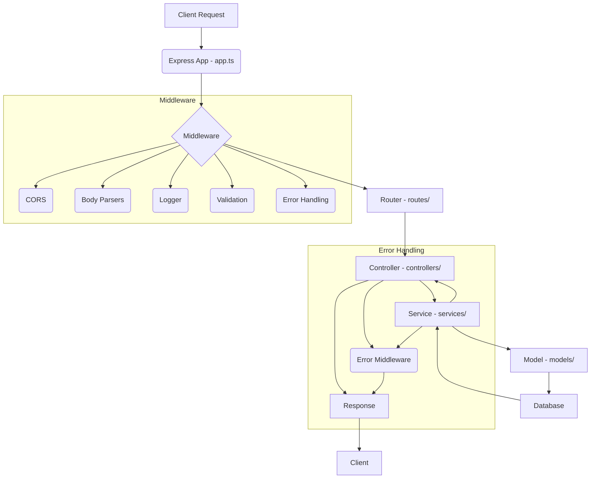

# Project Architecture Overview

The project follows a layered architecture, common in RESTful API development, promoting separation of concerns and maintainability.

## 1. Project Structure Overview

- **`src/app.ts`**: The entry point of the application, responsible for setting up the Express server, applying global middleware (CORS, JSON parsing, URL encoding, logging, error handling), and mounting API routes.
- **`src/routes/`**: Defines the API endpoints and maps them to corresponding controller functions. Each resource (e.g., `todo`) has its own route file.
- **`src/controllers/`**: Contains the business logic for handling incoming requests. Controllers receive requests, validate input (often using middleware), call appropriate service functions, and send back responses. They are responsible for request/response handling, not direct database interaction.
- **`src/services/`**: Encapsulates the core business logic and interacts directly with the database models. Services perform CRUD operations, data transformations, and any complex operations related to a specific resource. This layer abstracts database interactions from the controllers.
- **`src/models/`**: Defines the Mongoose schemas and models for the database collections. Each model represents a collection in MongoDB and defines its structure and validation rules.
- **`src/middleware/`**: Houses custom Express middleware functions for tasks like logging, error handling, input validation, and ID validation.
- **`src/config/`**: Stores configuration files, such as database connection settings (`connectDB.ts`) and CORS options (`corsOptions.ts`).
- **`src/utils/`**: Contains utility functions and helper modules used across different parts of the application (e.g., `successResponse`, `constants`).
- **`src/types/`**: Defines TypeScript interfaces and types for data structures used in the application.
- **`src/validators/`**: Contains validation schemas (e.g., using Zod) for incoming request bodies.
- **`src/logs/`**: Directory for application logs.
- **`src/lib/`**: (Currently empty, but typically for third-party integrations or shared libraries).

## 2. Request Flow Diagram

## 3. Benefits of Separation: Services from Controllers

The clear separation between the `controllers` and `services` layers offers significant advantages:

- **Single Responsibility Principle (SRP)**:
  - **Controllers**: Focus solely on handling HTTP requests and responses (parsing request bodies, setting status codes, sending JSON responses). They act as the entry point for API requests.
  - **Services**: Focus exclusively on business logic and data manipulation. They contain the core logic for interacting with the database (via models) and performing any necessary data transformations or computations.
- **Improved Testability**:
  - Controllers can be tested in isolation, mocking the service layer. This allows testing of request parsing, routing, and response formatting without needing a live database.
  - Services can be tested independently, mocking the database models. This ensures that the business logic is correct, regardless of the HTTP context.
- **Enhanced Maintainability and Readability**:
  - Code becomes easier to understand and navigate as responsibilities are clearly defined.
  - Changes to business logic are confined to the service layer, minimizing the risk of unintended side effects on the controller or routing logic.
- **Reusability**:
  - Service functions can be reused by multiple controllers or even other parts of the application (e.g., a background job or a different API version) without duplicating business logic.
- **Scalability**:
  - As the application grows, this separation makes it easier to scale different parts independently. For example, if the business logic becomes very complex, the service layer can be further broken down or optimized without affecting the API interface.
- **Database Abstraction**:
  - The service layer acts as an abstraction over the database. If the database technology changes (e.g., from MongoDB to PostgreSQL), only the service layer and models need to be updated, leaving controllers untouched.

## 4. Error Handling Middleware

The application implements a robust error handling mechanism using several middleware functions defined in `src/middleware/errorhandler.ts`:

- **`ErrorHandler` Class**: A custom error class that extends the built-in `Error` class. It allows for custom status codes to be associated with specific error messages, providing more granular control over API responses.
- **`routeEndpointNotFound` Middleware**: This middleware is responsible for catching requests that do not match any defined routes. It creates a `404 Not Found` error and passes it to the next error handling middleware.
- **`errorMiddleware`**: This is a centralized error handling middleware that catches various types of errors and transforms them into a consistent API response format. It specifically handles:
  - **CastError (Wrong MongoDB ID Error)**: Catches errors when an invalid MongoDB ID is provided, returning a 400 Bad Request.
  - **Duplicate Key Error (Code 11000)**: Handles MongoDB duplicate key errors, typically occurring during creation of unique fields, returning a 400 Bad Request.
  - **Mongoose Validation Error**: Catches validation errors defined in Mongoose schemas, extracting and formatting the error messages for a 400 Bad Request.
  - **JsonWebTokenError (Wrong JWT Token)**: Handles invalid JWT tokens, returning a 400 Bad Request.
  - **TokenExpiredError (JWT Expired)**: Catches expired JWT tokens, returning a 400 Bad Request.
  - For other unhandled errors, it defaults to a 500 Internal Server Error.
- **`genericErrorHandler`**: This is the final error handling middleware. It logs the error details using `logEvents` (from `logger.middleware.ts`) and sends a standardized JSON error response to the client. In a production environment, it hides the stack trace for security reasons.

This layered approach to error handling ensures that all errors are caught, logged, and presented to the client in a consistent and informative manner, improving the API's reliability and user experience.
