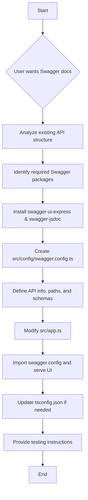

# Plan to Generate Swagger Documentation

This document outlines the detailed plan to generate Swagger documentation for the existing API.

## Goal 1: Install Swagger-related packages

- Install `swagger-ui-express` and `swagger-jsdoc` as dependencies.

## Goal 2: Create Swagger configuration file

- Create a new file, `src/config/swagger.config.ts`, to define the Swagger options.
- This file will include:
  - Basic API information (title, version, description).
  - Definitions for API paths, including request methods, parameters, request bodies, and responses for each endpoint (e.g., for `/api/v1/todos`).
  - Schema definitions for the `Todo` model and any other relevant data structures, derived from `src/models/todo.model.ts` and `src/validators/todo.validator.ts`.

## Goal 3: Integrate Swagger into the Express application

- Modify `src/app.ts` to import and use the generated Swagger documentation.
- Set up a new route (e.g., `/api-docs`) to serve the Swagger UI.

## Goal 4: Update `tsconfig.json` for new files (if necessary)

- Ensure that the new `swagger.config.ts` file is included in the TypeScript compilation.

## Goal 5: Test the Swagger documentation

- Provide instructions on how to start the application and access the Swagger UI in the browser.

## Plan Diagram

